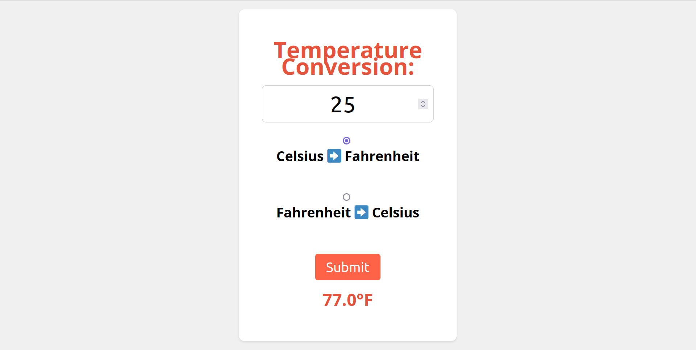

# Temperature Conversion

A temperature conversion tool built using HTML, CSS, and JavaScript. Users can convert temperatures between Celsius and Fahrenheit.


## Features

- User input for temperature
- Conversion between Celsius and Fahrenheit
- Interactive result display

## Getting Started

### Prerequisites

To run this project, you will need:

- A modern web browser

### Installation

1. Clone the repository:
    ```bash
    git clone https://github.com/geovannewashington/temperature-conversion.git
    ```

2. Navigate to the project directory:
    ```bash
    cd temperature-conversion
    ```

3. Open `index.htm` in your web browser.

## Usage

1. Enter the temperature in the input field.
2. Select the conversion unit (Celsius to Fahrenheit or Fahrenheit to Celsius).
3. Click the "Submit" button to see the converted temperature.
4. View the result in the result section.

## License

This project is licensed under the MIT License - see the [LICENSE](LICENSE) file for details.


